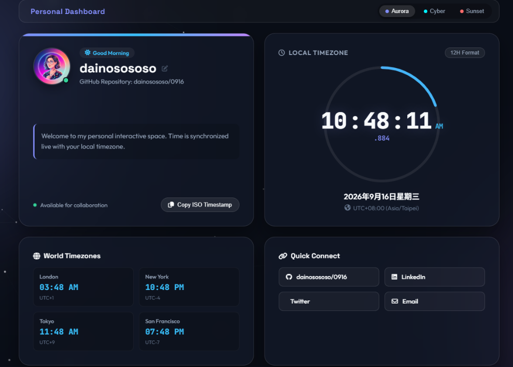

# 0916

Personal Dashboard & Live Clock Web Application for **dainosososo**.



## 🌐 Live Demo & Pages
- **GitHub Pages:** [https://dainosososo.github.io/0916/](https://dainosososo.github.io/0916/)
- **Repository:** [https://github.com/dainosososo/0916](https://github.com/dainosososo/0916)

## ✨ Features
- 🕒 **Live High-Precision Clock:** Real-time hours, minutes, seconds, milliseconds ticker with smooth circular SVG progress indicator.
- 🌍 **World Timezones:** Live tracking for London, New York, Tokyo, and San Francisco.
- 🎨 **Glassmorphism Design:** Customizable theme picker (Aurora, Cyberpunk, Sunset) with particle canvas background.
- ✍️ **Editable Name & Profile:** Click-to-edit user profile persisted in local storage.
- ⚡ **12H/24H Format Toggle & ISO Timestamp Copy.**

## 🛠️ Tech Stack
- HTML5 / CSS3 (Vanilla CSS Custom Properties & Glassmorphism) / JavaScript (ES6)

## 🚀 Quick Start
Open `index.html` in any modern web browser or serve locally:
```bash
python -m http.server 8080
```
Visit `http://localhost:8080`.
